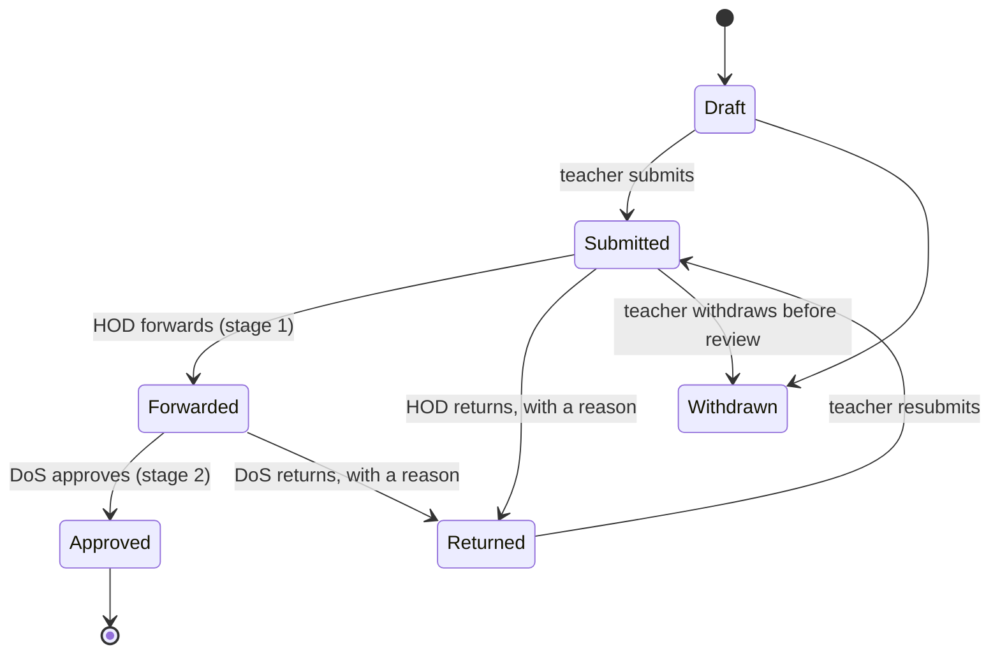

# Lesson plans and schemes of work

**Status: DECIDED 2026-09-26 — L1–L12 taken as recommended; the form is the main route (user: *"for the decisions, implement your recommendations. form should be main route"*). Being built; §11 records where the build departs from the plan.**
Artifact: https://claude.ai/artifact/GrjY8qNAeEjuY3jsp2ntUu

The request, in the school's words: *"a teacher submits the scheme of work to their head of department, head of department
forwards to director of studies"*. On approval both the teacher and the director of studies are told. A teacher can upload a
lesson plan as a PDF, but the product must shrink it itself, because many staff cannot. There is an entry gate of about 50 KB
or whatever is recommended. A subject teacher must be able to write a lesson plan quickly, and there should be templates in
the school's own format to download and fill. Existing infrastructure is preferred; no new table unless it is truly needed.

Everything below was checked against the working tree on top of `8e96aa0`. Three read-only audits covered segregation of
duties, reusable infrastructure, and outside sources. §10 lists every outside source and says which were fetched and read.

---

## 0. The answer in one paragraph

**Nothing in the product today does teacher → head of department → director of studies.** The only chain with several
approvers is the appraisal, and it has no rule against one person acting at more than one stage. It also lets a Director of
Studies sign their own appraisal. **"The author cannot approve" is written by hand in seven places and missing in six.** That
is fixed first, through one shared rule (§3).

**Lesson plans and schemes of work become one new table, `TeachingPlans`.** The plan explains why no existing table can
carry them (§5.1). A plan is filled in on the page, pre-filled from the timetable and the scheme, so it costs about 2 KB of
text rather than a stored file. Printing it is the browser's job, as it already is for every report.

**An uploaded PDF is rebuilt in the browser before it is sent.** The text is lifted out with pdf.js (already used) and set
again in a fresh PDF with pdf-lib, in fonts every reader carries. A typical one-page plan should come to 5–10 KB; §6.3
explains why that is an estimate the spike must measure. The rebuild also strips anything active out of the file. The server
checks every file again and refuses anything over the cap.

**Templates download as Word files built from the school's own sections.** A filled Word file uploaded back is *read into
the form*, not stored. The server already reads `.docx` tables (`DocxReader`).

---

## 1. What exists today (verified)

### 1.1 Segregation of duties: where "the author cannot decide" is enforced

| Where | Rule | Server | UI mirror |
|---|---|---|---|
| Self-service requests | requester ≠ decider; a refusal needs a reason; a swap needs the colleague's agreement first | `StaffSelfService.RefuseDecision` (`StaffSelfService.cs:342-359`), called in `StaffSelfServiceController.cs:571` | `CanIDecide` (`:1095`), `SelfServiceSection.razor:208` |
| Registers | nobody marks themselves, except a lesson, where the mark is stored as a self-report | `StaffDutiesController.cs:443-447` | `StaffRegister.razor:358, 698` |
| Lesson flags | the teacher self-reports; a supervisor's mark cannot be replaced by the teacher's | `StaffLessonsController.cs:224-246` | — |
| Duty reports | the author never reviews their own report | `StaffDutyReports.AccessForAsync` (`:154-156`), `StaffDutyReportsController.cs:321` | `DutyReportPage.razor:53` |
| Import inbox | optional: the uploader cannot approve their own upload (off by default) | `ImportInbox.cs:310-316` | `ImportInbox.razor:85-108` |
| Roles | nobody grants a role above their own, or one carrying permissions they lack | `RoleAssignmentGuard.cs:22-66` | the role picker |
| Accounts | nobody changes an account whose role they could not have given | `UsersController.SubjectRefusalAsync` (`:48-62`) | — |
| Leadership | nobody appoints themselves acting head | `LeadershipController.cs:263` | — |
| Lowering a rung | lowering welfare or staff visibility, or a document's classification, needs a reason, never a second person | `WelfareController.cs:1100`, `StaffRecordsController.cs:721`, `DocumentSharesController.cs:167` | prompts on each page |

### 1.2 Where it is missing (gaps found)

| # | Gap | Where | Effect |
|---|---|---|---|
| G1 | **An appraisal can be reviewed, moderated and signed by the same person, including the subject.** | `StaffAppraisalsController.cs:517-598`; `CanIModerate` in `StaffPerformanceMapping.cs:338` | A Director of Studies holding `staff.appraisals.approve` can sign their own appraisal. |
| G2 | A performance record can be logged about oneself (only Recognition is blocked). | `StaffRecordsController.cs:365` | A head of department can give themselves "Records & Schemes of Work" points, up to 20 a term. |
| G3 | A person can annul or re-score a Conduct record about themselves if they hold `staff.records.edit`. | `CanActOnRecordAsync` (`:1169`) | Evidence about a person can be removed by that person. |
| G4 | The person who wrote the minutes can adopt them. | `StaffMinutesController.cs:225-272` | Only the meeting is compared, never the person. |
| G5 | "No duty that day" on a duty report can be approved by its author. | `StaffDutyReportsController.cs:348` | A self-excused report reads as supervisor-approved. |
| G6 | The colleague in a swap or cover who holds `timetable.manage` can both agree and approve. | `RefuseDecision` excludes only the requester | Two of the three people in the flow are one person. |
| G7 | A holder of `staff.structure.manage` can make themselves head of a department. | `StaffStructureController.ValidateDepartmentAsync` (`:760-783`) | That quietly adds every head-of-department grant. |
| G8 | The import inbox's second approver is off by default. | `ImportInbox.cs:22` | A policy choice, recorded here, not changed. |
| G9 | The access review is attested by one person. | `LeadershipController.cs:517-535` | A policy choice, recorded here, not changed. |

### 1.3 What the chain can reuse

- **Departments and their heads.** `Subject.DepartmentId` (nullable) → `Department.HeadUserId` / `DeputyHeadUserId`.
  `PostPermissionService.DepartmentHeadPost` gives the head and deputy their grants, and `StaffScopeService` gives them the
  department's staff.
- **The director of studies is found by permission, never by role code.** Every existing chain does this, for example
  `StaffLookups.UsersWithPermissionAsync(..., staff.appraisals.approve)`. The Head Teacher and Deputy also hold the Director
  of Studies' set.
- **Who teaches what.** A live `ClassTeacherAssignment` with `Role = SubjectTeacher` (class name + `SubjectId`),
  `TimetableLesson`, and lesson duties (`StaffDuty.Kind = Lesson`) materialised 14 days ahead.
- **Closest document pattern:** `StaffDutyReport`. It has template sections in `SectionsJson`, Draft → Submitted → Returned
  → Reviewed, a snapshot on return, claims made with a conditional update, and access decided in one place. **But it has one
  review stage and `DutyId` is required.**
- **Closest chain pattern:** `StaffAppraisal` (Open → Self-assessment → Appraiser review → Moderation → Signed).
- **Tenant-editable templates** live in the policy blob (`DutyReportTemplate`, `MinutesTemplate`). A section key is a wire
  format and is locked once used.
- **"Records & Schemes of Work"** is already a seeded scoring parameter (Contribution, 2 points, at most 5 per entry and 20 per
  term: *"Schemes of work, lesson plans and mark books submitted on time and to standard"*). Today it can only be logged by
  hand.
- **Notifications and reminders:** `NotifyManyAsync`, `NotificationEventKeys` (with a permission field), the reminder ladder
  (a new subject takes five steps), and `IActivityLogger`.
- **Print and publish:** `QPrintSheet` on `MinimalLayout`, and `ReportPublishing`. The latter renders a picture of the page,
  so its output has no selectable text.

### 1.4 Uploads today

- The allow-list takes images, audio, video and `.pdf` only; **`.docx` is refused**. A `.pdf` must start with `%PDF-`, and
  nothing else is checked inside it.
- **No PDF is compressed anywhere.** `qFileUpload.js` shrinks images only. Every endpoint accepts 25 MB.
- **Storage is metered for the Library only.** `RecalculateStorageUsageAsync` sums `MediaContents`. Staff evidence,
  duty-report files and welfare evidence are uncounted, and the per-module `MaxStorageMb` is checked on one endpoint.
- pdf.js 3.11.174 already loads on demand (`pdfFlipbook.js`, `importDocuments.js`, which also extracts text runs), and so
  does html2pdf. **pdf-lib is not used yet.** SheetJS writes `.xlsx` in the browser. **Nothing writes a `.docx`.**

---

## 2. Practice and evidence (sources in §10)

**What a plan contains in Uganda.**
- NCDC's lower-secondary syllabuses organise every subject by class, term and topic, each topic with a duration in periods, a
  **competency**, **learning outcomes tagged (k), (u), (s)**, suggested activities and sample assessment.
- NCDC tells teachers to *"base their lesson plans on the Learning Outcomes using the Suggested Learning Activities as a
  guide"*.
- Plans also name generic skills, values, cross-cutting issues and key learning outcomes. A topic ends with an **Activity of
  Integration**, scored on relevance, accuracy, coherence and excellence.
- NCDC's own 2025 study of its templates found them clear but *"overly demanding… time-consuming"* for large classes. The
  commonest request was **separate columns for teacher activities and learner activities**, with the key learning outcomes
  shown prominently.
- The exact official field list for the lower-secondary scheme and lesson plan was found only in secondary copies, **so the
  template is the school's to edit, and the default is marked "confirm against NCDC"**.

**How schools check plans.**
- In Uganda, head teachers and heads of department carry out *portfolio supervision* of schemes, lesson plans and notes.
- A study of 934 teachers in 95 schools found it improves teaching (odds ratio 2.3). But schemes were reviewed with few
  constructive comments, and *"only 42.6% of the lesson plans are reviewed to ensure relatedness to the syllabi"*.
- Kenya's TSC requires *approved* schemes of work, updated lesson plans and records of work, and assesses them in the
  teacher's appraisal.
- **The documented gap is review quality, not paperwork.** So the review screen is built for quick, specific comments tied
  to a section.

**Workload.**
- The UK review of planning workload found **38% of teachers named detailed lesson and weekly planning as an unnecessary
  burden**. It recommends fully resourced schemes of work for every teacher each term, with individual plans used for
  discussion with the subject lead rather than as proof.
- Ofsted says it *"does not require schools to provide individual lesson plans"*.
- Ugandan practice does expect a plan for every lesson. **The school sets the rule (L6), and the product makes each plan
  cheap.**

**Structure.**
- Backward design (Understanding by Design): outcomes first, then evidence, then activities.
- Rosenshine's ten principles: daily review, small steps, questioning, models, guided practice, checks for understanding,
  scaffolds, independent practice, weekly review.
- Gagné's nine events.
- NCDC's own phases (introduction, development, evaluation, conclusion) fit all three. The default template uses NCDC's
  names.

**How modern planners work.**
- Planboard, Planbook and Common Planner are timetable-driven planbooks: drag and drop, **bump lessons forward**, reuse year
  to year, school-wide templates, standards tagging with coverage reports, and a leader who comments inside the plan.
- Toddle, Atlas and ManageBac go from curriculum map to unit to lesson, with customisable templates.
- **Microsoft Teach, Gemini in Classroom, Toddle, Atlas and Oak's Aila generate draft plans with AI.** Every one says the
  teacher must check the result.

**Automated planning, the evidence.**
- The EEF/NFER randomised trial (259 teachers, December 2024) found **31% less planning time (25 minutes a week) with no
  detectable loss of quality**. It did not measure pupil outcomes.
- The UK DfE's user research found plain AI models scored about 2 out of 5 against national standards. Tools grounded in the
  curriculum did better.
- DfE and UNESCO both require a human in the loop and no personal data sent to AI tools.
- **The automation this plan builds is not AI.** It is pre-filling from what the school has already entered: the timetable,
  the roll, the scheme and the curriculum. AI drafting is L8, a later decision.

---

## 3. One rule for segregation of duties

**`Application/Services/DutySeparation.cs` becomes the one home.** It is a static rule plus a DTO flag, the shape
`RefuseDecision` / `CanIDecide` already has:

```csharp
// null = allowed; otherwise the sentence the page shows.
public static string? Refusal(Guid actorId, Guid authorId, IEnumerable<Guid?> earlierActors, string act)
```

- **The author never takes a decision on their own work.**
- **Nobody takes two stages of one item.** The head of department who forwarded a scheme cannot also approve it, even when
  they hold the approval permission.
- **An override is never silent.** A step that has nobody else to take it is skipped by rule (§4.3) and recorded as skipped;
  it is never taken by the author.
- The client mirrors it through `CanI…` flags computed on the server, so a button is absent, not refused.

**Phase 0 applies it to the gaps:**
- G1: appraisal review, moderation and sign-off must be three different people, never the subject.
- G2: no performance record about oneself, except a self-report the system makes (`RecordSource.SelfReport`).
- G3: nobody annuls or re-scores a record about themselves.
- G4: the person who last wrote the minutes cannot adopt them.
- G5: "no duty" needs somebody other than the author.
- G6: the colleague in a swap or cover cannot decide it.
- G7: nobody appoints themselves head of department.

G8 and G9 stay as they are, but are listed on the Access tab so a school sees them. **Section 44 in the e2e suite tries each
one.**

---

## 4. The approval chain

### 4.1 States

`TeachingPlanStatus`: **Draft → Submitted → Forwarded → Approved**, with **Returned** (back to the author, with a reason)
from either review stage, and **Withdrawn**.



- **A submitted plan is frozen.** To change it, the teacher withdraws it, or it is returned. A return keeps a snapshot of
  what was returned, the duty-report pattern.
- **An approved plan is never edited.** A later change is a new version that points at the one it replaces. The approved
  version stays readable, as minutes do.
- **The one field open after approval is the teacher's reflection** ("self-evaluation / remarks" in NCDC's form). It is
  written after the lesson and recorded in the trail.
- **Every transition is claimed with a conditional update**, so two reviewers pressing at once cannot both act.

### 4.2 Who acts at each stage

| Stage | Who | Resolved from |
|---|---|---|
| Author | a teacher with a live subject-teacher assignment for that class and subject (or the lesson's teacher) | `ClassTeacherAssignment` / `TimetableLesson` |
| Stage 1: review | the **head of the subject's department**, else its deputy | `Subject.DepartmentId → Department.HeadUserId / DeputyHeadUserId` |
| Stage 2: approve | a holder of **`teaching.plans.approve`** (seeded: Director of Studies, Academic Assistant, Head Teacher, Deputy) | permission, through `NotificationAudience.HoldersAsync` |

### 4.3 When the chain meets the same person twice

| Case | What happens |
|---|---|
| The author is the head of department | Stage 1 goes to the deputy head of department; if there is none, it is **skipped and recorded**. |
| The subject has no department, or the department has no head | Stage 1 is skipped and recorded, and the page says so to the school. |
| The author is the Director of Studies | Stage 2 goes to another holder (Head Teacher, Deputy or Academic Assistant). If nobody else holds it, the plan waits, and the Access tab lists it. |
| The head of department also holds `teaching.plans.approve` | They forward, and somebody else approves. |
| A lesson plan, with the school's "one stage for lesson plans" setting (L4) | Stage 1 approves, and stage 2 is informed by a weekly digest. |

### 4.4 Who is told, and when

| Event | Told | Key |
|---|---|---|
| Submitted | head (or deputy) of the department | `staff.plan-submitted` |
| Forwarded | stage-2 approvers; the teacher is told it moved on | `staff.plan-forwarded` |
| **Approved** | **the teacher, the Director of Studies (stage-2 holders) and the head of department who forwarded it** | `staff.plan-approved` |
| Returned | the teacher, with the reason | `staff.plan-returned` |
| Weekly | each department head and the Director of Studies: plans approved, waiting and missing | added to the existing Monday analysis |

**Lesson plans are many.** Sixty teachers writing one per lesson is about 47,000 a year. So by default the Director of Studies
is told about each **scheme**, and about lesson plans **in the weekly digest**, never one message per plan (L4). The keys go
into `NotificationEventKeys.All` with a permission, so a teacher is never offered switches for notices they cannot receive.

### 4.5 Who may read a plan

`TeachingPlanAccess.ForAsync` is the one home, the `StaffDutyReports.AccessForAsync` shape:

- **Draft:** the author only.
- **Submitted and later:** the author, the department's head and deputy, and stage-2 holders within their staff scope.
- **Approved:** also `teaching.plans.view` holders, and the department's teachers when the school switches on sharing, the
  "build a school archive" practice.
- Everybody else gets **404, never 403**.

---

## 5. What to build

### 5.1 Data: one new table, and why

**`TeachingPlans`**, one row per lesson plan or scheme of work:

| Column | Notes |
|---|---|
| `Id`, `OrganizationId`, `BranchId` | |
| `Kind` | `LessonPlan` or `SchemeOfWork` |
| `AuthorUserId`, `SubjectId`, `ClassNames text[]` | several streams can share one plan |
| `PeriodKey` | the term (`2026-T3`), from the policy's periods |
| `LessonDate`, `DutyId?`, `TimetableLessonId?` | a lesson plan's lesson |
| `SchemeId?`, `SchemeRowKey?` | a lesson plan's line in its scheme |
| `Title`, `SectionsJson jsonb`, `RowsJson jsonb` | a lesson plan's sections; a scheme's week rows |
| `TemplateKey`, `TemplateVersion` | which template it was written against |
| `Status`, `SubmittedAt`, `ForwardedByUserId`, `ForwardedAt`, `Stage1Skipped`, `ApprovedByUserId`, `ApprovedAt`, `ReturnedAt` | the chain |
| `TrailJson jsonb` | append-only comments, returns with snapshots, skips, reflection edits |
| `Reflection` | written after the lesson |
| `FileUrl`, `FileName`, `FileSizeBytes`, `OriginalSizeBytes`, `FilePages` | an uploaded PDF, one per plan |
| `Version`, `SupersedesId?`, `RowVersion (xmin)` | |
| `ReminderStage`, `LastRemindedAt` | |
| `CreatedAt` …, `IsActive` | |

Two indexes:
- A partial unique index: one live plan per author and lesson (`DutyId`), and one live scheme per author, subject, class
  key and term.
- An index on (`OrganizationId`, `Status`, `SubjectId`) for review queues.

**Why a table, when the rule is to enhance first.** Every candidate was checked:

| Existing | Why it cannot carry this |
|---|---|
| `StaffDutyReport` | `DutyId` is required and a scheme has no duty; access is duty-report permission and supervisors; one review stage. Making it do both would give it two meanings. |
| `StaffConfigRequest` | One decision slot, timetable-master deciders, no document body, no return-and-resubmit loop. |
| `StaffPerformanceRecord` | An append-only scoring event, not a document; it keeps its role (§5.8). |
| `MediaContent` (Library) | Gated by the Communications module and `content.create`, read by any `content.view` holder, and organisation-wide. |
| `StaffDuty` (lesson) | A column on the lesson would lose every scheme, and a plan shared by three streams. |

A plan is its own resource with its own lifecycle. It is queried by person, department, term and state, and needs its own
reminder stage, which is the same argument that justified `StaffMinuteAction`. **Nothing else is added:**
- attachments are columns (one file per plan);
- the trail is JSON on the row;
- templates and the curriculum live in the settings blob;
- records of work are derived, never stored.

### 5.2 Templates: the school's own format

- **`StaffPerformancePolicyDto.LessonPlanTemplate` and `.SchemeTemplate`**, read only through
  `IStaffPerformancePolicyService`, as the duty-report and minutes templates already are. A section key locks once plans are
  stored under it.
- **Section kinds:** `Text`, `Choice`, `TeacherLearner` (the two-column activity table NCDC's study asked for, with phases
  as rows), `Rows` (the scheme's week table), and `Header`. `Header` fields are filled automatically: school, class, subject,
  date, time, number of learners, term, week, topic.
- **Default lesson plan (NCDC-aligned, marked "confirm against NCDC"):**
  - the header;
  - topic and sub-topic;
  - competency;
  - learning outcomes (k/u/s);
  - generic skills, values and cross-cutting issues (as choices);
  - prior knowledge;
  - learning materials and references;
  - **procedure**: introduction, development, evaluation and conclusion, each with teacher activity, learner activity and
    minutes;
  - assessment;
  - **reflection**, after the lesson.
- **Default scheme of work:** week, periods, topic, sub-topic, competency, learning outcomes, methods and activities,
  teaching aids, references, assessment, and remarks.
- **The editor sits in Setup → Scoring Policy**, beside the duty-report and minutes templates, gated on
  `staff.parameters.manage`. A preview shows the form and the printed sheet.

**Download to fill in by hand or in Word.**
- **`.docx` built on the server with `System.IO.Compression.ZipArchive`**: a few hundred lines of XML, with no library and
  no server dependency.
- It carries the school's name in the header, the header fields already filled, one table per section, and the teacher and
  learner columns.
- It also carries the template key and version in the document's custom properties.
- A blank printable version is a print route for schools that write by hand.

**Upload the filled Word file back: it is read, not stored.**
- The existing `DocxReader` reads the tables, and a small extension reads the template key.
- Sections are matched by key, falling back to title. The text lands in the form for the teacher to check and submit.
- **No file is kept, so a Word-based workflow costs no storage at all.**
- `.docx` stays off the stored-upload allow-list. It is read through the same in-memory path the programme import uses.

### 5.3 Writing a plan quickly

The target is **under three minutes for a routine lesson**.

- **Start from the lesson.** "Plan this lesson" appears on My School Day, on the My teaching tab and on the week grid. The
  header fills itself:
  - class, subject and date from the timetable;
  - time, duration and period from the school day;
  - number of learners from the roll for that class;
  - term and week from the policy's periods;
  - **topic, sub-topic, competency and outcomes from this week's line of the approved scheme**.
- **Copy forward.** A lesson that continues a topic takes the last plan's outcomes and materials. **"Same plan for S2B and
  S2C"** makes one plan cover parallel streams, which is one row with several class names.
- **Bump.** A lesson that was missed (the lesson flag already says so) carries its plan to the recovery lesson. Planboard
  and Planbook both treat this as a core feature.
- **The week grid.** A Planboard-style planbook of the teacher's own timetable shows each lesson's plan state: none, draft,
  waiting, approved or returned.
- **The curriculum list.** A school may enter, or import from CSV, each subject's topics per class and term, with periods,
  competency and outcomes: NCDC's programme planner. It is stored in `Organization.Settings["Curriculum"]` through
  `OrganizationSettingsLock`, and feeds the scheme's rows and the plan's pick-lists. Without it everything still works,
  just with more typing.
- **Records of work are derived, never typed.** A scheme's rows × the lessons flagged taught = what was covered, which
  gives the records-of-work sheet on a print route.

### 5.4 Uploading a PDF: the internal shrinking

**Where it runs.** In the browser, in `wwwroot/js/planPdf.js`. It uses pdf.js (already loaded on demand) and **pdf-lib
1.17.1 from jsDelivr, loaded on demand**. The standing rule allows client-side CDN libraries; nothing is installed on the
server.

**The entry gate, before any work:**
- `.pdf` only;
- at most **10 MB read** (this is the file to be shrunk, not what is stored);
- at most **4 pages for a lesson plan and 30 for a scheme**;
- it must open in pdf.js.

Anything else is refused on the spot, in words.

**The pipeline, in order.** It stops at the first step that meets the target.

1. **Small already.** If the file is at or under the target and the active-content scan finds nothing, keep it as it is.
2. **Rebuild the text.** This is the step that does the work.
   - pdf.js `getTextContent()` gives every run of text with its position and size.
   - `getOperatorList()` gives the ruled lines and boxes of tables.
   - pdf-lib writes a fresh PDF of the same page size, drawing each run in the matching Standard-14 font (Helvetica, Times
     or Courier, regular or bold, chosen from the original font's name) and redrawing the lines as thin strokes.
   - Standard-14 fonts need no embedding, because every reader carries them (ISO 32000-1 §9.6.2.2).
   - The embedded font subsets and pictures, which are what make Word's PDFs large, are gone.
   - **This is also Content Disarm & Reconstruction (OWASP).** Nothing from the original file's structure survives, so no
     script, action or attachment can either.
3. **Characters outside the Standard-14 set.** Luganda's **ŋ**, for example, is not in WinAnsi. For those, one small free
   font (Noto Sans) is embedded, **subset to just the characters used** (pdf-lib with fontkit), which adds a few KB.
4. **A page with no text** (a scan, or a phone photo of a handwritten plan):
   - render at about 110 dpi;
   - convert to black and white with an adaptive threshold (a document scanner's treatment);
   - store as a PNG image in the PDF.
   - Handwriting on a 1-bit page should come to 25–45 KB, which is an estimate the spike must measure. A multi-page scan
     over the cap is refused, and the page offers the form or the Word template instead.
5. **Pictures in a text PDF** (a diagram in a science plan) are kept only if the budget allows: grayscale JPEG at 96 dpi,
   largest first, until the budget is spent. Anything else is replaced by a box reading "picture removed". The preview
   shows this before the teacher confirms.

**The teacher sees the result before it is sent**: the rebuilt page beside the original, the size before and after
("312 KB → 7 KB"), and any picture that was removed. **Send** uploads the rebuilt file; the original never leaves the
browser.

### 5.5 The server's own gate

The browser is a courtesy, never a control. The server checks every file again, with `System.IO.Compression.ZLibStream`
and no library:

- **Size cap**, refused as 413 with the limit in words.
- `%PDF-` at the start and `%%EOF` near the end.
- **Every stream is inflated and every object scanned.** It refuses `/JavaScript`, `/JS`, `/OpenAction`, `/AA`, `/Launch`,
  `/EmbeddedFile`, `/RichMedia`, `/XFA` and `/AcroForm`, and object streams it cannot inflate. It also counts pages against
  the limit.
- **Stored under a server name** as `UploadOwnerKind.TeachingPlan`. `UploadAuthorizer` classifies it before media and reads
  through `TeachingPlanAccess`, so a draft's file is the author's alone. **Anything new fails closed**, as now.
- **It counts towards the school's storage.** `RecalculateStorageUsageAsync` is widened to every upload kind (it counts the
  Library only today), and the plan upload checks `IsWithinStorageLimitAsync`.
- A school may switch uploads off and use the form and Word templates only.

### 5.6 Recommended limits (L3)

| | Target (browser aims for) | Hard cap (server refuses above) | Pages |
|---|---|---|---|
| Lesson plan | **50 KB** | **64 KB** | 4 |
| Scheme of work (a term) | **150 KB** | **200 KB** | 30 |

**Why these numbers.** A rebuilt text page should come to roughly 5–10 KB, so a one-page lesson plan sits well under 50 KB
and a fifteen-page scheme under 150 KB. The cap leaves headroom for one diagram or a one-page scan. **The spike in Phase 3
measures real Word-exported plans and resets these numbers if they are wrong.**

**Storage over a year** for a school of 60 teachers, about 47,000 lesson plans and 600 schemes:

| How plans are kept | Per lesson plan | A year |
|---|---|---|
| Typed in the form (JSON) | ~2 KB | **~0.1 GB** |
| Filled Word template, read back | ~2 KB (nothing stored) | **~0.1 GB** |
| Uploaded and rebuilt, at typical size | ~8 KB | ~0.4 GB |
| Uploaded, at the 64 KB cap | 64 KB | ~3 GB |
| Uploaded as Word exports them, untouched | 300–600 KB | **14–28 GB** |

**This is why the form is the main route and the upload is the fallback (L2).** Even at the cap, an upload costs about 30
times what a typed plan does.

### 5.7 Permissions (all three catalogues)

| Code | Seeded to |
|---|---|
| `teaching.plans.review` | granted by the **head-of-department post** (`PostPermissionService.DepartmentHeadPost`), head and deputy |
| `teaching.plans.approve` | Director of Studies, Academic Assistant, Head Teacher, Deputy |
| `teaching.plans.view` | the same, plus Administrator; to read approved plans school-wide |

**Writing one's own plan needs no code.** It needs a live teaching assignment, which fails closed: nobody plans for a class
they do not teach. Everything sits in the Welfare & Performance module, with the rest of Staff Performance.

### 5.8 Credit, reminders, reports

- **Credit.** Behind the existing "automatic credit" switch (off by default), an approved plan submitted on time adds a
  system record on "Records & Schemes of Work", within that parameter's caps. A returned plan adds nothing. Nobody can log
  it about themselves (G2).
- **Reminders on the existing ladder:**
  - `ReminderSubject.PlanDue`: a lesson with no submitted plan by the school's deadline, default 18:00 the day before;
  - `ReminderSubject.PlanReview`: a plan waiting on a reviewer for more than 48 hours.
  Each is claimed through `TeachingPlans.ReminderStage` before sending.
- **Reports on the Timetable hub's Teaching Reports**, one builder, the `TeachingReportBuilder` rule:
  - plan coverage per department and week (lessons taught with an approved plan);
  - schemes in and approved per subject and term;
  - **review turnaround and the share of reviews with a comment**, which is the gap the Ugandan study found;
  - records of work.

### 5.9 Where it appears

| Place | What |
|---|---|
| My Workspace → **My teaching** | "My plans" card: this week's lessons, each with its plan state and "Plan this lesson"; schemes for the term |
| My Workspace → **Today** | one to-do line: "3 lessons tomorrow have no plan" |
| My School Day | a plan chip on each lesson |
| Timetable hub → new **Plans** tab | the review queue: stage 1 for heads of department, stage 2 for approvers; filters by department, subject, class and state; open, comment, forward, approve, return |
| Setup → Scoring Policy | the two template editors, file limits, the one-stage switch, the sharing switch, the plan deadline |
| Print routes | a plan, a scheme, records of work; "Save as PDF" is the browser's; nothing is stored |

---

## 6. Decisions (all taken as recommended, 2026-09-26)

| # | Question | Recommendation | Alternative |
|---|---|---|---|
| L1 | Where plans live | **One new table, `TeachingPlans`** (§5.1) | Widen `StaffDutyReport` with a nullable duty and a second stage |
| L2 | The main route | **Typed in the form, pre-filled; Word template read back; PDF upload as the fallback** | Upload first |
| L3 | Size limits | **Lesson plan 50 KB target / 64 KB cap / 4 pages; scheme 150 KB / 200 KB / 30 pages** | A flat 50 KB for both, which a term's scheme will not meet |
| L4 | Stages for lesson plans | **Schemes always go through both stages; lesson plans through the head of department, with the Director of Studies informed weekly, and a school switch for two stages** | Both stages for every lesson plan (about 47,000 notices a year) |
| L5 | Same person twice | **Skip to the deputy, else skip the stage and record it** (§4.3) | Refuse to submit |
| L6 | What the school requires | **A plan for every lesson, with the school able to switch to "weekly" or "schemes only"** | Fixed |
| L7 | Templates | **`.docx` generated on the server with `ZipArchive`, read back with `DocxReader`, plus a printable blank** | `.xlsx` through SheetJS |
| L8 | AI drafting | **Not in this build.** Later, grounded in the school's curriculum list, with a human approving and no personal data sent. It needs an outside AI service, which is a new dependency and a data-protection decision. | Build it now |
| L9 | Curriculum list | **`Organization.Settings["Curriculum"]`, entered or imported from CSV, optional** | A table per topic |
| L10 | Scoring credit | **Automatic, behind the existing switch, off by default** | Manual only |
| L11 | Fixing G1–G7 | **All of them, first, as Phase 0** | Only what the plan chain touches |
| L12 | Sharing approved plans with the department | **Off by default, a school switch** | Always shared |

---

## 7. Phases

| Phase | Contents | Size |
|---|---|---|
| **0 — Segregation of duties** | `DutySeparation`; G1–G7; the Access tab lists G8/G9; section 44 | S–M |
| **1 — The chain** | `TeachingPlans` table and migration; `TeachingPlanAccess`; the three permissions in all three catalogues; submit / forward / approve / return / withdraw / versions; notifications; the Plans review tab; the form with default templates | L |
| **2 — Templates** | the two editors; `.docx` download (`ZipArchive`); `.docx` read-back; printable blank; print routes for a plan and a scheme | M |
| **3 — Uploads** | a spike to measure real plans and fix L3's numbers; `planPdf.js` (gate, rebuild, fonts, scans, preview); the server's inflate-and-scan gate; `UploadOwnerKind.TeachingPlan`; storage metering widened to every upload kind | M |
| **4 — Speed** | "Plan this lesson" everywhere; header pre-fill; scheme line → plan; copy forward and parallel streams; bump; the week grid; the curriculum list and CSV import; records of work | M |
| **5 — Follow-through** | credit; the two reminder subjects; the reports; the weekly digest lines | S–M |

**Phase 0 can ship alone, and should.** G1 is a real flaw in a live feature.

## 8. Verification

- **API section 44, `separation-of-duties-e2e.mjs`.** Each of G1–G7 is attempted by the person who must not be able to do
  it, and asserted refused in words. Each is then done by the right person.
- **API section 45, `teaching-plans-e2e.mjs`:**
  - the full chain;
  - an author who is the head of department (goes to the deputy, then skipped and recorded);
  - a Director of Studies who is the author;
  - a head of department who holds approve cannot approve what they forwarded;
  - five simultaneous approvals, only one lands;
  - a returned plan keeps its snapshot;
  - an approved plan cannot be edited, and a new version supersedes it;
  - who is told at each step (including the Director of Studies on approval);
  - 404 for a colleague outside scope;
  - uploads refused over the cap and with `/JavaScript` or `/OpenAction` (fixtures built by the suite);
  - the storage count rises.
- **Browser suites:**
  - `lesson-plan-ui.mjs`: plan a lesson from My Workspace in under the form's required fields, submit, review as the head
    of department, approve as the Director of Studies.
  - `plan-pdf.mjs`: feed a Word-style PDF with embedded fonts, a scan-like image PDF and one with ŋ, and assert each lands
    under its target with the text still selectable where there was text.
  - `plan-templates.mjs`: download the `.docx`, fill it in the suite (through `ZipArchive`), upload it back, and assert the
    form holds the text.
- **Guard `separation-check.mjs`:** every endpoint that changes a plan's or an appraisal's stage calls `DutySeparation`.

## 9. Not in this plan

- AI drafting (L8).
- Students or guardians seeing plans.
- Marking schemes and mark books (the parameter names them, but they are another feature).
- A national syllabus import from NCDC (no machine-readable source was found).
- Two-way sync with Google Classroom or Microsoft Teams.

The standing rules hold: no server dependency (the `.docx` writer and the PDF scan use the base library, and pdf-lib runs in
the browser), no Postgres extension, and printing stays the browser's job.

---

## 10. Sources

"Read" means the page or document was retrieved and read. "Search only" means it appeared in results but could not be
retrieved; nothing in this plan rests on a search-only source alone.

**Uganda and the region**
- NCDC (A. Kakooza, S. Bogere), *Exploring Best Practices in the Development and Utilisation of Lesson Plans and Schemes of Work for… the Competency-Based Lower Secondary Curriculum*, Nov 2025. https://uwezouganda.org/download/NCDC%20Report%20on%20SOW%20and%20Lesson%20Plans_Working.pdf — read.
- NCDC, *Lower Secondary Curriculum: Mathematics Syllabus*, 2019. https://ncdc.go.ug/wp-content/uploads/2024/02/Mathematics_Syllabus_compressed.pdf — read.
- NCDC, *Prototype ICT Teacher's Guide, Senior One*, 2020. https://ncdc.go.ug/wp-content/uploads/2024/02/ICT_Prototype_TG.pdf — read.
- NCDC/MoES, *Primary School Curriculum Teacher's Guide, P1*, 2016. https://ncdc.go.ug/wp-content/uploads/2024/02/P1_Curriculum_TG.pdf — read.
- Lower-secondary lesson plan template (secondary copy). https://www.scribd.com/document/597986941/21012020-LESSON-PLAN-TEMPLATE-FOR-LOWER-SECONDARY — search only.
- P. Malunda, D. Onen, J.C.S. Musaazi, J. Oonyu, *Instructional Supervision and the Pedagogical Practices of Secondary School Teachers in Uganda*, Journal of Education and Practice 7(30), 2016. https://files.eric.ed.gov/fulltext/EJ1118918.pdf — read.
- Teachers Service Commission (Kenya), checklist of professional documents, via Education News Hub, Feb 2026. https://educationnewshub.co.ke/tsc-tpad-new-checklist-of-professional-documents-to-be-maintained-by-teachers/ — read (the TSC original: search only).

**Planning practice**
- J. McTighe, G. Wiggins, *Understanding by Design Framework*, ASCD, 2012. https://files.ascd.org/staticfiles/ascd/pdf/siteASCD/publications/UbD_WhitePaper0312.pdf — read.
- DfE, *Eliminating unnecessary workload around planning and teaching resources*, 2016. https://assets.publishing.service.gov.uk/media/5a7f1c3a40f0b6230268d7fa/Eliminating-unnecessary-workload-around-planning-and-teaching-resources.pdf — read.
- Ofsted, *Ofsted inspections: myths*, 2016. https://dera.ioe.ac.uk/id/eprint/27087/1/Ofsted%20inspections%20myths%20-%20GOV_UK.pdf — read.
- B. Rosenshine, *Principles of Instruction*, American Educator 36(1), 2012. https://www.aft.org/sites/default/files/Rosenshine.pdf — read.
- Northern Illinois University, *Gagné's Nine Events of Instruction*. https://www.niu.edu/citl/resources/guides/instructional-guide/gagnes-nine-events-of-instruction.shtml — read.

**Products**
- Common Planner. https://www.commonplanner.com/ — read.
- Planbook, teacher tips. https://blog.planbook.com/planbook-teacher-tips/ — read.
- Toddle, curriculum planning. https://www.toddleapp.com/product/curriculum-planning/ — read.
- Atlas features. https://www.onatlas.com/atlas-features — read.
- Microsoft, *Lesson Plan Creation with AI*. https://support.microsoft.com/en-us/teams/education/lesson-plan-creation-with-ai — read.
- Google, *Gemini in Google Classroom*. https://support.google.com/edu/classroom/answer/15410566?hl=en — read.
- Oak National Academy, *Introducing Aila*. https://www.thenational.academy/blog/introducing-aila-for-ai-lesson-planning — read.
- ManageBac, *Customising Unit Planner Templates*; Planboard — search only.

**Automated planning**
- NFER for EEF, *ChatGPT in lesson preparation – a Teacher Choices trial*, Dec 2024. https://www.nfer.ac.uk/publications/chatgpt-in-lesson-preparation-a-teacher-choices-trial/ — read.
- Oak National Academy, *How is Aila impacting teacher lesson planning… early insights*. https://www.thenational.academy/blog/how-is-aila-impacting-teacher-lesson-planning-practices-workload-and-expertise-early-insights — read.
- Oak National Academy, *How do we ensure our AI-generated resources are high-quality?*, Jan 2025. https://www.thenational.academy/blog/how-do-we-ensure-our-ai-generated-resources-are-high-quality — read.
- Oak National Academy, *Building AI that's safe for the classroom*, Jul 2025. https://www.thenational.academy/blog/building-ai-that-s-safe-for-the-classroom-what-we-have-learned-with-aila — read.
- DfE, *Generative artificial intelligence (AI) in education*, updated Aug 2025. https://www.gov.uk/government/publications/generative-artificial-intelligence-in-education/generative-artificial-intelligence-ai-in-education — read.
- DfE, *Use cases for generative AI in education: user research report*, Aug 2024. https://assets.publishing.service.gov.uk/media/66cdb078f04c14b05511b322/Use_cases_for_generative_AI_in_education_user_research_report.pdf — read.
- UNESCO, *Guidance for generative AI in education and research*, 2023. https://www.unesco.org/en/articles/guidance-generative-ai-education-and-research — read.
- EEF, *Aila Teacher Choices trial* (reports autumn 2026) — search only.

**Separation of duties, PDFs and uploads**
- NIST SP 800-53 Rev. 5, AC-5 *Separation of Duties*, read through https://csf.tools/reference/nist-sp-800-53/r5/ac/ac-5/; canonical https://csrc.nist.gov/pubs/sp/800/53/r5/upd1/final.
- ISO 32000-1:2008 (PDF 1.7), Adobe-hosted. https://opensource.adobe.com/dc-acrobat-sdk-docs/pdfstandards/PDF32000_2008.pdf — read (§9.6.2.2 Standard 14 fonts; §9.6.4 font subsets; §12.6.4 actions; §7.11.4 embedded files).
- Microsoft, *Save or convert to PDF*. https://support.microsoft.com/en-us/office/save-or-convert-to-pdf-or-xps-in-office-desktop-apps-d85416c5-7d77-4fd6-a216-6f4bf7c7c110 — read.
- pdf-lib. https://pdf-lib.js.org/ and https://github.com/Hopding/pdf-lib — read; 1.17.1 on cdn.jsdelivr.net, checked live.
- Mozilla, PDF.js `PDFPageProxy`. https://mozilla.github.io/pdf.js/api/draft/module-pdfjsLib-PDFPageProxy.html — read.
- OWASP, *File Upload Cheat Sheet*. https://cheatsheetseries.owasp.org/cheatsheets/File_Upload_Cheat_Sheet.html — read.
- D. Stevens, *PDF Tools (PDFiD)*. https://blog.didierstevens.com/programs/pdf-tools/ — read.

---

## 11. As built (2026-09-26) — where the build departs from the plan

All six phases are built. Migration `20260926163934_LessonPlansAndSeparationOfDuties` adds the one table
(`TeachingPlans`) and two columns: `StaffAppraisals.ReviewedByUserId` and `StaffDuties.PlanReminderStage`.

- **G1 is narrower than §3 said.** "Three different people" would forbid a moderator from signing in the same act,
  which is one stage. The rule as built is: **the subject never reviews, moderates or signs, and whoever wrote the
  review never moderates or signs.** An approver may still write the review in the appraiser's place. The appraisal
  now records who actually wrote it (`ReviewedByUserId`); rows from before this change fall back to the appraiser.
- **"Withdraw" returns a plan to Draft**, and a separate **Discard** takes a draft out (status Withdrawn). The plan's
  state diagram had Withdrawn doing both jobs.
- **The chase for a lesson with no plan is claimed on the LESSON** (`StaffDuty.PlanReminderStage`), because there is no
  plan row to claim it on. One nullable-cost column, not a table.
- **Credit goes on its own automatic parameter, "Plan approved on time"**, seeded with the other four automatic ones
  and off behind the same switch, rather than on "Records & Schemes of Work". That parameter stays a head of
  department's judgement, and an automatic credit must never be mistaken for one. The credit counts the first
  submission, so a return does not cost it.
- **My School Day carries no plan chip.** The Today tab's to-do line ("3 lessons coming up have no plan yet") and the
  My teaching card's week do that job; a chip would have needed a change to the lesson-day endpoint for no new
  information.
- **Storage is metered for every kind of upload**, not the Library alone (`StorageUsage`). This was a gap before the
  plan: welfare, staff and duty-report evidence and broadcast attachments were never counted.
- **A Word template carries its section keys in the document's custom properties** (`s.<key>`, `c.<key>`), so a
  template downloaded before the school renamed a section still reads back into the right place.
- **Letters outside the Standard-14 fonts** (ŋ) are set in Noto Sans, fetched from jsDelivr and subset to the letters
  used. If the font cannot be fetched, the letter is written in its plainest form (ŋ as ng), and the teacher is told.
- **Found by running it, fixed:** approving a *revision* failed for everyone. The old version stopping being current
  and the new one starting were one save, and the database may apply the two in either order, so the one-current-plan
  index refused the pair. The old version is now retired first, inside the same transaction. Section 45 approves a
  revision on every run.
- **Found by the new guard, fixed:** returning or reviewing a duty report was protected only by the access flags. Both
  now ask `DutySeparation` explicitly, which is what `separation-check.mjs` enforces.
- **G6 is not exercised live.** A swap or cover needs a published timetable with lessons for two teachers. The rule is
  in `StaffSelfService.RefuseDecision` and `CanIDecide`, and section 44 says so as a SKIP.

### Verified

| Suite | Result |
|---|---|
| API §44 `separation-of-duties-e2e.mjs` (new) | 25 / 0, 1 skip (G6) |
| API §45 `teaching-plans-e2e.mjs` (new), run repeatedly | 95 / 0 |
| API §17 `minutes-e2e.mjs` (adopter changed for G4) | see the tracker |
| Browser `lesson-plan-ui` · `plan-pdf` · `plan-templates` (new, visible Chrome) | 22 · 15 · 9 / 0 |
| Guards (one new: `separation-check`) | 22 / 22 |

`plan-pdf` measured real shrinking in the browser. A text PDF carrying 200 KB of dead weight was stored under the
50 KB target. A 702 KB phone-style scan with no text was stored as black and white within the 64 KB cap, at least five
times smaller.

### Added the same day, at the user's request

- **Printed plans are headed by the school** (`PlanSheetHead`: logo, name and a rule in the school's own colour; a
  line, never a shaded fill, for black-and-white printers). The FILLED lesson plan or scheme prints from the form in the
  school's own sections. Every choice list shows all its options with the chosen ones ticked, as the paper form would.
  The review fills the signature lines: the teacher, the head of department and the Director of Studies, with dates. An
  unapproved plan is stamped "Not yet approved". The branding comes from the BRANCH's public endpoint, because the
  settings one needs `settings.view`, which a teacher does not hold.
- **A blank lesson plan and a blank scheme print for writing by hand** (`/plans/blank/print?kind=lesson|scheme`). They
  are drawn from the same template as the form and the Word file, from `GET teaching-plans/templates`, which any member
  of staff may read. Buttons are on the My plans card.
- **Found by looking at a screenshot:** under the dark theme the section titles inherited a light heading colour and
  printed white on white. The sheet's colours are now pinned to black, and the browser suite asserts it.
- **The report names every teacher's scheme** (`SchemeSummaryDto`): not started, draft, with the head of department,
  with the approver, returned or approved, with each count, "late" against the school's due week, and a filter that
  opens on "not yet approved". Beside it is lesson-plan coverage per teacher. The Monday email lists the teachers whose
  schemes are not yet approved, with each one's state.

Section 45 is now 99 checks, and `lesson-plan-ui` is 29; both 0 failed.
